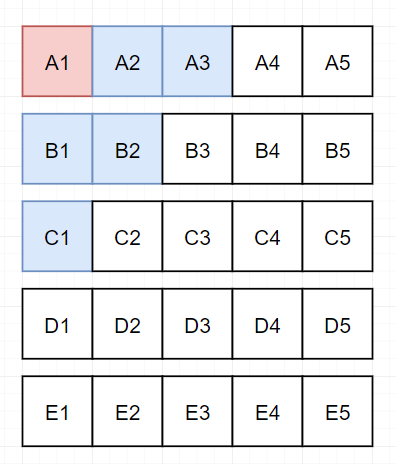

# IP地址与整数的转换

https://zhuanlan.zhihu.com/p/358928393

# 灯泡开关

https://zhuanlan.zhihu.com/p/370584190

# 面试中的智力题

## 01、量出4升水

怎么用3升和5升的桶量出4升的水？

题目没什么补充的，直接分析，一个3升和5升的水桶：

首先用三升水桶装满水，倒入五升水桶：

再次倒满三升水桶，填满后继续倒入五升水桶，直到五升水桶倒满。

清空五升水桶，将三升水桶的一升水倒入：

再次填满三升水桶，倒入五升水桶中：

## 02、最大的钻石

1 楼到 n 楼的每层电梯门口都放着一颗钻石，钻石大小不一。你乘坐电梯从 1 楼到 n 楼，每层楼电梯门都会打开一次，只能拿一次钻石，问怎样才能拿到「最大」的一颗？

其实题中包含一个隐藏条件：**随机放置**。所有的分析都是基于随机放置给出的。**换句话说，如果放置钻石是人为干预大小，那么本题的所以分析则全部不成立**。

其实这个问题的原型叫做秘书问题，该类问题全部属于**最佳停止问题**。

再给出一个严谨的推导过程：

所以到我们的题目里，我们也是可以直接给出答案：**我们要选择先放弃前 37%（就是1/e）的钻石，此后选择比前 37% 都大的第一颗钻石。**

事实上也有人通过测试证明了这个数据：

当 n=30 时，测试一万次，可以看到有 4000 次我们拿到了最大的钻石。

## 03、思维定势

这道题中有六个停车位，每个车位上都有一个数字，然而有一个车位上的数字被汽车挡住了，要求学生们在20秒内答出这个被挡住的车位上的数字。这是中国香港小学一道给6岁儿童设计的“停车场智力题”。

旋转180°看如下图：

汽车所在的停车位的数字应为87。我们现在是反过来看的，再把87反过去看，显示的应该是L8。

# 25匹马的经典问题

有一个赛场上共有25匹马，赛场有5个跑道，不使用计时器进行比赛（也就是每次比赛只能得到本次的比赛的顺序），试问最少比多少场才能选出最快的三匹马？并给出分析过程！

答案是7次

分析过程：

- 5次：首先我们把25匹马分成5组（A、B、C、D、E），跑上五次，得到每组的第一名。

  

- 1次：然后我们让这5个第一名跑上一次，得到其中的前三名。**注意：这里就可以得到所有马中跑的最快的第一名A1了。并且，D1和E1所在的组可以直接淘汰。第二名和第三名一定不会在其中产生！**

  

- 1次：因为我们已经跑出了第一名，所以A1不需要再参加比赛，同时，D1和E1所在的组已经淘汰。C1作为第三组的第一名，C组不会有跑的比C1快的。而B2有可能是比C1跑的快的第三名。同理，A2和A3也有可能是比B1和B2跑的快的。所以第7次比赛，我们让**A2，A3，B1，B2，C1**来一起完成。(求大家不要怪我啰嗦，，，我是实在担心有那么几个同学听不懂...)

  

最终，我们**通过7次比赛**，得到25匹马中的前三名。

## 03、升级版本

还是25匹马，如果我们要找到其中跑的最快的**前五名**，最少需要比赛几次呢？

在上面的的分析中，我们已经明确了第一名。**但是第二名和第三名，是可以在A2-A3-B1-B2-C1中产生的**，我们需要分别进行讨论。

- 假若二三名分别为：A2，A3

  对于这种情况，**第四名可能是A4**，此时第五名是A5或者B1。**第四名也可能是B1**，此时第五名是B2或者C1。所以我们只需要让［A4，B1，A5，B2，C1］参加一次比赛，就可以得到前五名。

- 假若二三名分别为：A2，B1

  对于这种情况，第四名可能是A3、B2、C1。**假设第4名为A3**，第5名可能为A4、B2、C1。**假设第4名为B2**，第5名可能为A3、B3、C1。**假设第4名为C1**，第5名可能为A3、B2、C2、D1。此时我们需要至少两次比赛，才能在［A3，A4，B2，B3，C1，C2，D1］中找到第四名和第五名，所以就需要9次。

其他的可能性还有：

- 假若二三名分别为：B1，A2
- 假若二三名分别为：B1，B2
- 假若二三名分别为：B1，C1

上面这三种情况分析的方法一致，就不一一说明了，大概的思路就是，我们需要**根据第三名，分析出可能的第四名**。**再根据第四名，分析出对应情况下的第五名**。最终再在这些马匹里，抉择出真正的第四名和第五名。

因为题中问的是**最少比多少场可以跑出前五名**。所以根据分析，假如**第二名和第三名是A2和A3的话，只需要8次就可以跑出前五名**。最少次数是8。（这个题目其实是不严谨的，所以如果有面试官问到这个题，最好是给出所有可能性的推导过程）

