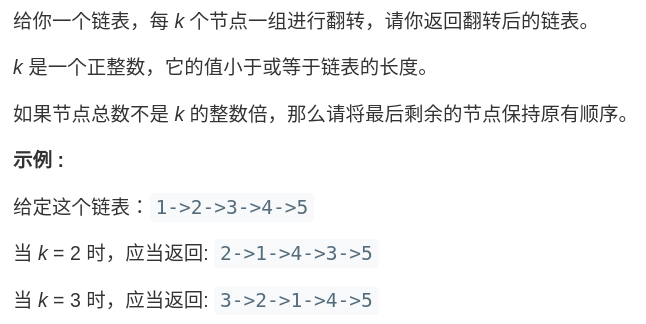

# 两个考点

- 指针的修改

翻转链表

- 链表的拼接

三个注意

## 环

环的考点有两个：

- 题目就有可能环，让你判断是否有环，以及环的位置。
- 题目链表没环，但是被你操作指针整出环了

# 链表

### 概念

* 类型：

单链表

双链表

循环链表：循环链表可以用来解决约瑟夫环问题。

* 所有数据结构的操作：访问和修改两种类型
  * 链表的操作：遍历、删除、插入

### 指针的修改

#### [203. 移除链表元素](https://leetcode-cn.com/problems/remove-linked-list-elements/)


**设置一个虚拟头结点在进行移除节点操作：**

```c
class Solution {
public:
    ListNode* removeElements(ListNode* head, int val) {
        ListNode* dummyHead = new ListNode(0); // 设置一个虚拟头结点
        dummyHead->next = head; // 将虚拟头结点指向head，这样方面后面做删除操作
        ListNode* cur = dummyHead;
        while (cur->next != NULL) {
            if(cur->next->val == val) {
                ListNode* tmp = cur->next;
                cur->next = cur->next->next;
                delete tmp;
            } else {
                cur = cur->next;
            }
        }
        head = dummyHead->next;
        delete dummyHead;
        return head;
    }
};
```


#### [707. 设计链表](https://leetcode-cn.com/problems/design-linked-list/)


```java
//单链表
class ListNode {
    int val;
    ListNode next;

    ListNode() {
    }

    ListNode(int val) {
        this.val = val;
    }
}

class MyLinkedList {
    // size存储链表元素的个数
    int size;
    // 虚拟头结点
    ListNode head;

    // 初始化链表
    public MyLinkedList() {
        size = 0;
        head = new ListNode(0);
    }

    // 获取第index个节点的数值
    public int get(int index) {
        // 如果index非法，返回-1
        if (index < 0 || index >= size) {
            return -1;
        }
        ListNode currentNode = head;
        // 包含一个虚拟头节点，所以查找第 index+1 个节点
        for (int i = 0; i <= index; i++) {
            currentNode = currentNode.next;
        }
        return currentNode.val;
    }

    // 在链表最前面插入一个节点
    public void addAtHead(int val) {
        addAtIndex(0, val);
    }

    // 在链表的最后插入一个节点
    public void addAtTail(int val) {
        addAtIndex(size, val);
    }

    // 在第 index 个节点之前插入一个新节点，例如index为0，那么新插入的节点为链表的新头节点。
    // 如果 index 等于链表的长度，则说明是新插入的节点为链表的尾结点
    // 如果 index 大于链表的长度，则返回空
    public void addAtIndex(int index, int val) {
        if (index > size) {
            return;
        }
        if (index < 0) {
            index = 0;
        }
        size++;
        // 找到要插入节点的前驱
        ListNode pred = head;
        for (int i = 0; i < index; i++) {
            pred = pred.next;
        }
        ListNode toAdd = new ListNode(val);
        toAdd.next = pred.next;
        pred.next = toAdd;
    }

    // 删除第index个节点
    public void deleteAtIndex(int index) {
        if (index < 0 || index >= size) {
            return;
        }
        size--;
        ListNode pred = head;
        for (int i = 0; i < index; i++) {
            pred = pred.next;
        }
        pred.next = pred.next.next;
    }
}
```


#### [206. 反转链表](https://leetcode-cn.com/problems/reverse-linked-list/)

给你单链表的头节点 `head` ，请你反转链表，并返回反转后的链表。

[24. 两两交换链表中的节点](https://leetcode-cn.com/problems/swap-nodes-in-pairs/)


#### [19. 删除链表的倒数第 N 个结点](https://leetcode-cn.com/problems/remove-nth-node-from-end-of-list/)

给你一个链表，删除链表的倒数第 `n` 个结点，并且返回链表的头结点。

**进阶：**你能尝试使用一趟扫描实现吗？

#### [07. 链表相交](https://leetcode-cn.com/problems/intersection-of-two-linked-lists-lcci/)


#### [142. 环形链表 II](https://leetcode-cn.com/problems/linked-list-cycle-ii/)

给定一个链表，返回链表开始入环的第一个节点。 如果链表无环，则返回 `null`。

### 链表的拼接

## 反转链表

### 反转整个链表

[206. 反转链表](https://leetcode-cn.com/problems/reverse-linked-list/)

迭代法：

```java
// 反转以root为头结点的链表
ListNode iterationReverse(ListNode root) {
    if (root == null)
        return null;
    ListNode pre = null;
    ListNode cur = root;
    ListNode nt;//记录当前节点的下一个节点
    while (cur != null) {
        nt = cur.next;
        //然后将当前节点指向pre
        cur.next = pre;
        pre = cur;
        cur = nt;
    }
    return pre;
}
```
递归法：
```java
// 递归函数的定义:输入一个节点 head，将「以 head 为起点」的链表反转，并返回反转之后的头结点。
ListNode reverse(ListNode head) {
    if (head.next == null)
        return head;
    ListNode last = reverse(head.next);
    head.next.next = head;
    head.next = null;
    return last;
}
```

要根据刚才的函数定义，来弄清楚这段代码会产生什么结果：


这个 `reverse(head.next)` 执行完成后，整个链表就成了这样：


接下来整个链表就反转过来了！


### 反转链表前 N 个节点

解决思路和反转整个链表差不多，只要稍加修改即可：

```java
ListNode successor = null; // 后驱节点

// 反转以 head 为起点的 n 个节点，返回新的头结点
ListNode reverseN(ListNode head, int n) {
    if (n == 1) { 
        // 记录第 n + 1 个节点
        successor = head.next;
        return head;
    }
    // 以 head.next 为起点，需要反转前 n - 1 个节点
    ListNode last = reverseN(head.next, n - 1);

    head.next.next = head;
    // 让反转之后的 head 节点和后面的节点连起来
    head.next = successor;
    return last;
}
```

图示如下：


### 反转链表的一部分

[92.反转链表II（中等）](https://leetcode-cn.com/problems/reverse-linked-list-ii/)

给你单链表的头指针 head 和两个整数 left 和 right ，其中 left <= right 。请你反转从位置 left 到位置 right 的链表节点，返回 反转后的链表 。

输入：head = [1,2,3,4,5], left = 2, right = 4
输出：[1,4,3,2,5]
示例 2：

输入：head = [5], left = 1, right = 1
输出：[5]


提示：

链表中节点数目为 n
1 <= n <= 500
-500 <= Node.val <= 500
1 <= left <= right <= n

---

1、递归：

首先，如果 m == 1，就相当于反转链表开头的 n 个元素嘛，也就是我们刚才实现的功能。如果 m != 1 怎么办？如果我们把 head 的索引视为 1，那么我们是想从第 m 个元素开始反转对吧；如果把 head.next 的索引视为 1 呢？那么相对于 head.next，反转的区间应该是从第 m - 1 个元素开始的；这就是递归思想，所以我们可以完成代码：

```java
//递归函数意义：以root为头结点，翻转[m,n]区间的链表，返回翻转后的头结点
ListNode reverseBetween(ListNode head, int m, int n) {
    // base case
    if (m == 1) {
        return reverseN(head, n);
    }
    // 前进到反转的起点触发 base case
    head.next = reverseBetween(head.next, m - 1, n - 1);
    return head;
}
```

值得一提的是，**递归操作链表并不高效。**和迭代解法相比，虽然时间复杂度都是 O(N)，但是迭代解法的空间复杂度是 O(1)，而递归解法需要堆栈，空间复杂度是 O(N)。

2、头插法：

解题思路：
1、我们定义两个指针，分别称之为 g(guard 守卫) 和 p(point)。
我们首先根据方法的参数 m 确定 g 和 p 的位置。将 g 移动到第一个要反转的节点的前面，将 p 移动到第一个要反转的节点的位置上。我们以 m=2，n=4为例。
2、将 p 后面的元素删除，然后添加到 g 的后面。也即头插法。
3、根据 m 和 n 重复步骤（2）
4、返回 dummyHead.next


```java
class Solution {
    public ListNode reverseBetween(ListNode head, int m, int n) {
        // 定义一个dummyHead, 方便处理
        ListNode dummyHead = new ListNode(0);
        dummyHead.next = head;

        // 初始化指针
        ListNode g = dummyHead;
        ListNode p = dummyHead.next;

        // 将指针移到相应的位置
        for(int step = 0; step < m - 1; step++) {
            g = g.next; p = p.next;
        }

        // 头插法插入节点
        for (int i = 0; i < n - m; i++) {
            ListNode removed = p.next;
            p.next = p.next.next;

            removed.next = g.next;
            g.next = removed;
        }

        return dummyHead.next;
    }
}
```

### [25.K个一组翻转链表](https://leetcode-cn.com/problems/reverse-nodes-in-k-group/)



什么叫递归性质？直接上图理解，比如说我们对这个链表调用 `reverseKGroup(head, 2)`，即以 2 个节点为一组反转链表：


**如果我设法把前 2 个节点反转，那么后面的那些节点怎么处理？后面的这些节点也是一条链表，而且规模（长度）比原来这条链表小，这就叫子问题。**


我们可以直接递归调用 reverseKGroup(cur, 2)，因为子问题和原问题的结构完全相同，这就是所谓的递归性质。

```c
ListNode reverseKGroup(ListNode head, int k) {
    if (head == null) return null;
    // 区间 [a, b) 包含 k 个待反转元素
    ListNode a, b;
    a = b = head;
    for (int i = 0; i < k; i++) {
        // 不足 k 个，不需要反转，base case
        if (b == null) return head;
        b = b.next;
    }
    // 反转前 k 个元素
    ListNode newHead = reverse(a, b);
    // 递归反转后续链表并连接起来
    a.next = reverseKGroup(b, k);
    return newHead;
}
```

